# 小型电动涵道垂直起降飞行器 Hoverjet

为了使火箭推进系统的高度复杂性与 GNC 的发展脱钩，开发一种试验性小型电动涵道垂直起降飞行器样机 Hoverjet。样机的主要目标是提供一个具有类似于火箭的动力学、相似传感器和动力系统，具有进行姿态控制能力的平台。

### 飞行器总体设计

Hoverjet 是用于测试姿态控制的 VTVL 飞行器，其基本组成包括机架、动力系统和飞控。动力系统由主引擎和 TVC 系统组成。主引擎是两台90mm的电动涵道风扇，通过 TVC 系统使得飞行器具有六个自由度运动的能力。

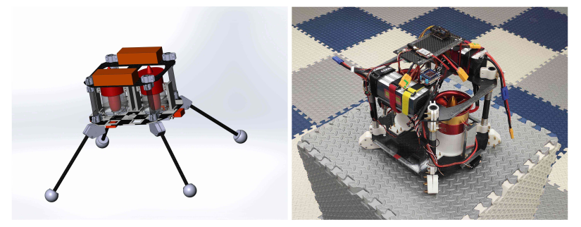

#### 动力系统

Hoverjet 的动力总成包括两个电动涵道风扇组成的主引擎，以及燃气舵组成的推力矢量控制系统。为了控制围绕飞行器的俯仰和滚转轴的姿态，在每个电动涵道风扇的下侧都放置了一个由燃气舵组成的推力矢量控制系统。

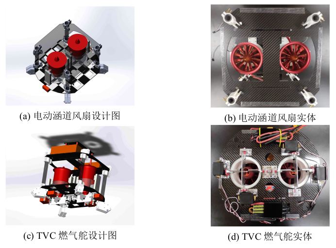

**推力矢量控制**：飞行器通过使用燃气舵改变电动涵道风扇的气流，进而来改变推力矢量的方向来控制自身。

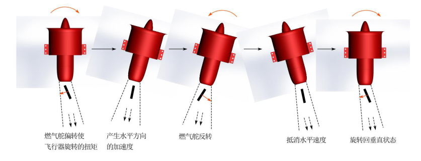

为了向右平移，飞行器必须使自身倾斜以产生水平速度，然后燃气舵反转使得机身向另外一侧倾斜以抵消水平速度并停在新的位置。

#### 飞控

飞控框架基于匿名科创的飞控版进行开发，主要分为两部分，一部分进行初始化，一部分轮询执行任务调度器中的任务。任务调度器包括目标量设置、反馈量设置、PID 控制、控制分配与电机输出等相关任务。

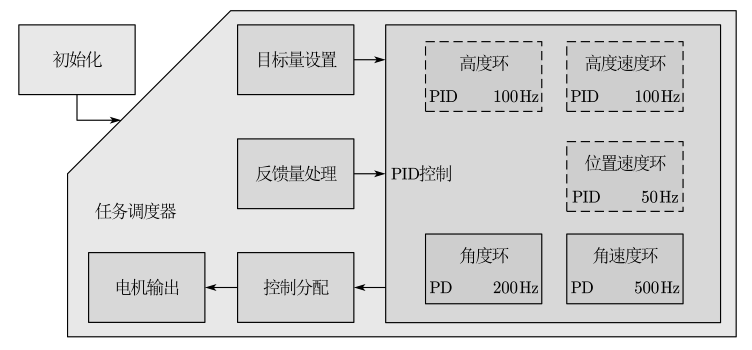

初始化包括各种传感器的初始化与校准、PID 系数等参数的设置。任务调度器中的目标量设置主要是解决输入量的问题， Hoverjet 可以通过程控或者遥控的方式根据遥控器杆量、上位机的指令任务的期望值对目标变量赋值。反馈量处理主要是进行状态估计解决反馈的问题，对 IMU、光流、tof 和 GPS 等传感器的测量结果进行处理，通过校准、滤波、数据融合、姿态解算等获得可以作为反馈量的值。PID 控制部分主要是控制高度和位置速度或者姿态，将运算结果输出给控制分配器。在 PID 控制部分中，本项目主要关注代表姿态控制的实线框角度环和角速度环环节的设计仿真与飞行测试，代表位置位置控制的虚线框包括高度环等暂不考虑。Hoverjet 飞控中没有使用实时系统，而是用定时器轮询执行任务，包括利用Systick 定时器实现的定时执行任务和借助传感器输出的 1ms 脉冲实现的外部中断任务，外部中断任务主要执行传感器数据获取。

### 建模

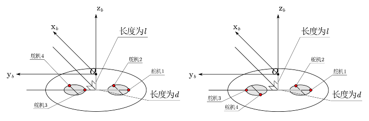

对 Hoverjet 进行建模的目的是通过输入四个舵偏角和油门（可以换算成推力的大小），得到输出姿态角和位置。通过改变涵道风扇油门的大小可以改变 Hoverjet所受到的推力。通过四个燃气舵的偏转可以改变涵道风扇喷出气流方向，从而产生俯仰力矩、滚转力矩和偏航力矩。

#### 动力子系统建模

动力子系统由两个电涵道风扇和四个燃气舵构成的 TVC 系统组成。燃气舵偏转方向的正负规定如下：

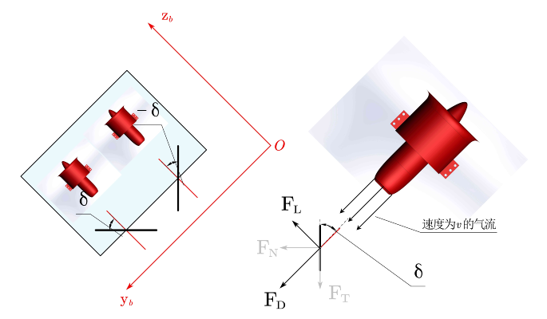

单个涵道风扇在燃气舵机作用下，所产生的力如下：
$$
\begin{align}
	\begin{split}
		\label{eq:vanes_dynamics}
		\boldsymbol{F}_1 &\approx
		\left(
		\begin{array}{ccc}
			T_1\sin\delta_1&T_1\sin\delta_2&T_1
		\end{array}
		\right)^\top
		\\ 
		\boldsymbol{F}_2 &\approx
		\left(
		\begin{array}{ccc}
			T_2\sin\delta_3&T_2\sin\delta_4&T_2
		\end{array}
		\right)^\top
	\end{split}
\end{align}
$$

#### Hoverjet 数学建模

为了简化模型，不妨增加约束$T_1 = T_2$，得到Hoverjet数学模型如下：
$$
\begin{align}
	\left\{
	\begin{array}{cl}
		m\ddot{x} =& T[c_{11}(\sin \delta_1 + \sin \delta_3)+c_{12}(\sin \delta_2 + \sin \delta_4)+c_{13}2] \\
		m\ddot{y} =& T[c_{21}(\sin \delta_1 + \sin \delta_3)+c_{22}(\sin \delta_2 + \sin \delta_4)+c_{23}2] \\
		m\ddot{z} =& T[c_{31}(\sin \delta_1 + \sin \delta_3)+c_{32}(\sin \delta_2 + \sin \delta_4)+c_{33}2] -mg
	\end{array}
	\right.
\end{align}
$$

$$
\begin{aligned}
	\left\{
	\begin{array}{cr}
		I_x\dot{\omega}_x &= (I_y-I_z)\omega_z\omega_y - Tl(\sin \delta_2 +\sin \delta_4)\\
		I_y\dot{\omega}_y &= (I_z-I_x)\omega_x\omega_z + Tl(\sin \delta_1+ \sin \delta_3) \\
		I_z\dot{\omega}_z &= (I_x-I_y)\omega_x\omega_y + Td(\sin \delta_3 - \sin \delta_1)
	\end{array}
	\right.
	\end{aligned}
$$

$$
\begin{aligned}
	\left\{
	\begin{array}{cl}
		\dot{\phi} &= \omega_x + (\omega_z \cos\phi  + \omega_y \sin\phi )\tan\theta  \\
		\dot{\theta} &= \omega_y\cos\phi -\omega_z\sin\phi   \\
		\dot{\psi} &= \frac{1}{\cos\theta }(\omega_z\cos\phi +\omega_y\sin\phi  )
	\end{array}
	\right.
	\end{aligned}
$$

$$
\begin{aligned}
	\left\{
	\begin{array}{cr}
		\dot{x} = uc_{11}+vc_{12}+wc_{13} \\
		\dot{y} = uc_{21}+vc_{22}+wc_{23} \\
		\dot{z} = uc_{31}+vc_{32}+wc_{33} 
	\end{array}
	\right.
	\end{aligned}
$$
在Hoverjet中，单个电动涵道风扇提供主推力 $\boldsymbol{T}$ ，假定该推力的方向是机体坐标系$B$的$z$轴正方向平行。
$$
\begin{align}
 \boldsymbol{T} = \Vert \boldsymbol{T} \Vert \textbf{e}^B_z
\end{align}
$$
推力 $\boldsymbol{T}$ 主要负责抵消重力，但是主推力的一部分可以偏转以控制姿态推力矢量。这里主要是通过燃气舵来改变涵道风扇喷出气流方向来产生XY平面的力，由此产生的偏转主推力的合力为 $\boldsymbol{T}_{TVC}$。力 $\boldsymbol{T}_{TVC}$可以通过旋转燃气舵使推力$\boldsymbol{T}$ 偏转来调节。燃气舵由舵机$s_1$、$s_2$、$s_3$和$s_4$产生的舵偏角$\delta_1$、$\delta_2$、$\delta_3$和$\delta_4$，它们与两个电动涵道风扇的油门$\sigma_1$、$\sigma_2$一起代表推力矢量控制的实际指令。因此确定油门命令和产生的力之间的映射关系。为了方便进行控制，不妨添加约束$\sigma_1 = \sigma_2 = \sigma$。
$$
\begin{Bmatrix}
 \sigma_1 \\ \sigma_2 \\ \delta_1 \\\delta_2 \\\delta_3 \\\delta_4
\end{Bmatrix}
\longleftrightarrow
 \boldsymbol{T}_{TVC}
\stackrel{\sigma_1 = \sigma_2 = \sigma}{\implies }
 \begin{Bmatrix}
\sigma \\ \delta_1 \\\delta_2 \\\delta_3 \\\delta_4
\end{Bmatrix}
\longleftrightarrow
\boldsymbol{T}_{TVC}
$$

### 姿态控制实验

**姿态控制**

在 Hoverjet 的实际姿态控制测试中，没有位置控制环节，油门指令 mc.ct_val_thr直接由遥控信号中的 thr 通道的信号给到控制分配器，姿态指令同样直接由遥控的roll、pitch 和 yaw 通道给到姿态控制器作为期望值。

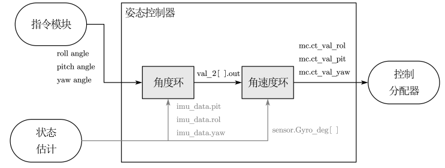

Hoverjet 的姿态控制采用内外环控制：角度环和角速度环。外环控制器为内环控制器提供指令，即把指令模块的输出作为姿态控制系统的参考值。在这里直接
将遥控三个姿态通道的摇杆量映射为限幅 ±20 ◦ 的指令，将遥控指令作为期望值，Hoverjet 姿态控制器的目标是姿态角和姿态角速度的稳定跟踪。外环角度环输入 3 个姿态角观测值作为反馈值，控制目的为姿态角恒定。内环角速度环分别输入 3 个姿态角的角速度观测值作为反馈值，控制目标为角速度恒定。

**控制分配**

Hoverjet 通过得到油门指令，将油门指令分配到两台电动涵道风扇上。同时通过姿态控制得到指令 mc.ct_val_rol、mc.ct_val_pit 和 mc.ct_val_yaw。

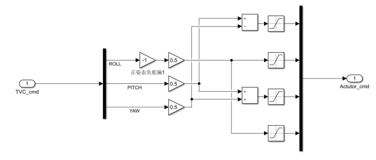

**仿真结果**

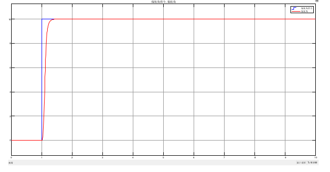

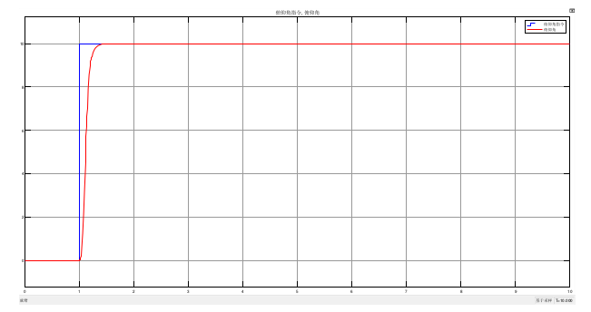

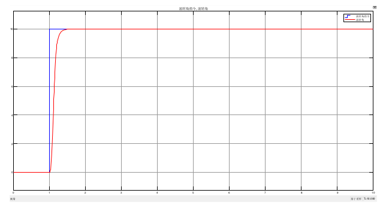

**飞行测试**

在姿态控制飞行测试中， Hoverjet 的顶部在尽量不影响运动自由度的前提下被系住

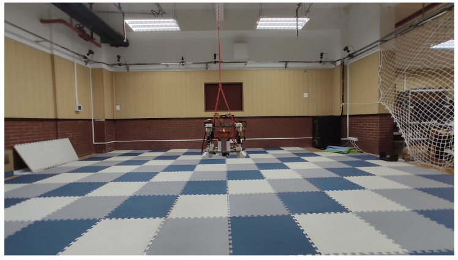

Hoverjet 的姿态控制器在维持自身姿态表现出了较好的性能，能够很好地跟踪动态指令。

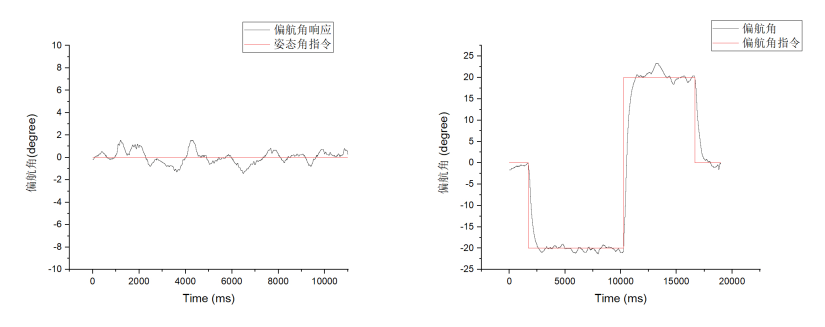

